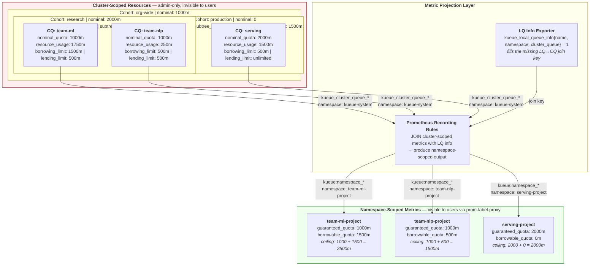
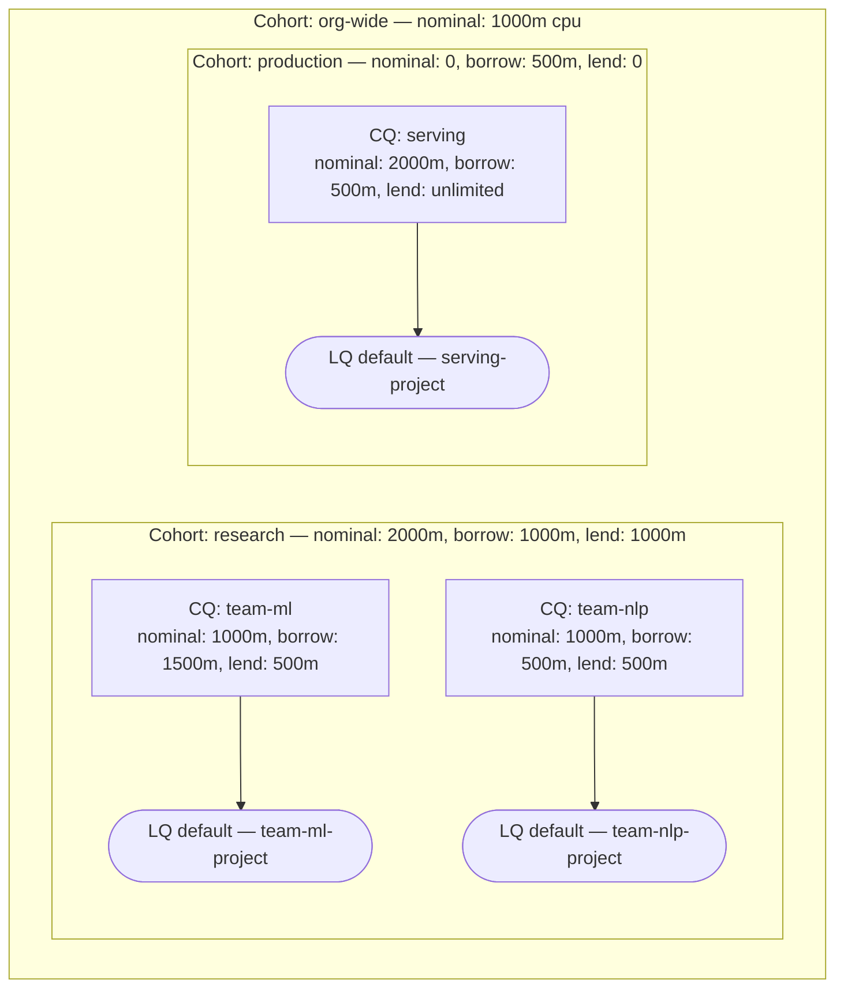
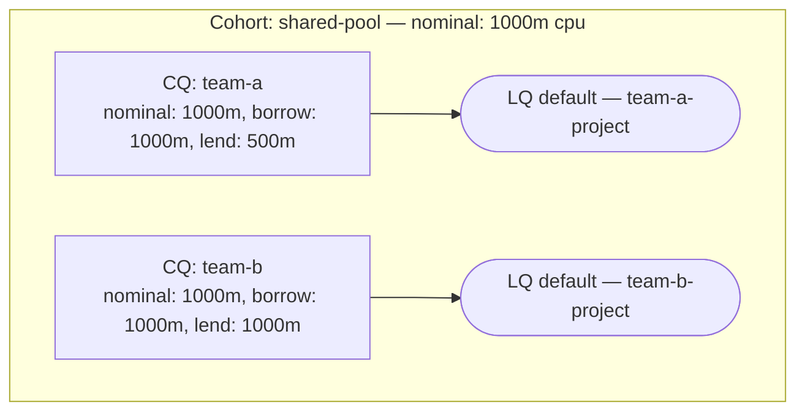

# Kueue Cohort Playground

Local KinD-based test environment for generating Kueue metrics and prototyping Prometheus recording rules that solve the "missing denominator" problem without upstream changes.

## The Problem

Data scientists see their GPU/CPU usage but not their quota ceiling — the "missing denominator." Quota is defined on cluster-scoped Kueue resources (ClusterQueues and Cohorts) that users have no RBAC access to, and the Prometheus metrics emitted by the Kueue controller carry the controller's own namespace (`kueue-system`), not the user's project namespace. On OpenShift, Thanos's prom-label-proxy on port 9092 enforces namespace isolation by rewriting every PromQL query to include a `namespace=` matcher, which means users can query metrics in their own namespace but never see the cluster-scoped ClusterQueue or Cohort metrics that define their quota ceiling.

The result: users can answer "how much am I using?" but not "how much am I allowed to use?" or "how much headroom do I have before I start borrowing / get throttled?"

### Why "the denominator" is not a single number

Intuitively, quota feels like a single limit — you have X GPUs, you've used Y, you have X−Y left. But Kueue's quota model has two tiers, and "the denominator" is really two ceilings depending on what question a user is asking:

1. **Guaranteed quota** — your dedicated allocation. Workloads within this limit are always admitted, regardless of what other teams are doing. This is stable: it only changes when an admin reconfigures the ClusterQueue. If a user asks *"what am I entitled to?"*, this is the answer.

2. **Effective ceiling** — your guaranteed quota plus whatever you can currently borrow from the shared Cohort pool. Workloads between the guarantee and this ceiling are admitted opportunistically — the capacity exists right now but could shrink as sibling teams reclaim their lending. If a user asks *"what is the maximum I could be running right now?"*, this is the answer.

The gap between the two is the **borrowable quota** — additional capacity available from the Cohort hierarchy that the Kueue controller would admit your workloads into today. It is dynamic: it depends on how much capacity siblings are lending, how much the parent Cohort pools contribute, and your ClusterQueue's borrowing limit.

So solving the denominator problem means exposing all three:

| What the user asks | Metric | Nature |
|---|---|---|
| "What am I entitled to?" | `kueue:namespace_guaranteed_quota` | Static — config-derived |
| "How much more could I borrow right now?" | `kueue:namespace_borrowable_quota` | Dynamic — changes with cluster state |
| "What is my actual ceiling?" | `guaranteed + borrowable` (compute inline) | Dynamic — trivial sum of the two above |

A user comparing their usage against the guaranteed quota knows whether they are within their dedicated allocation or borrowing. A user comparing against the effective ceiling knows how much total headroom remains before workloads start queuing.

## The Approach

This lab prototypes a solution that works without any upstream Kueue changes: **Prometheus recording rules** that join ClusterQueue-level quota metrics with a LocalQueue-to-ClusterQueue mapping metric, projecting the result into the user's namespace. The output metrics carry a `namespace` label matching the user's project, so they pass through prom-label-proxy and are queryable by namespace-scoped users via the standard OpenShift monitoring stack.

The approach requires solving one prerequisite gap: Kueue does not emit a metric that maps a LocalQueue (namespace-scoped, user-visible) to its parent ClusterQueue (cluster-scoped, admin-only). Without this join key, there is no way to associate a user's namespace with the ClusterQueue that governs their quota. This lab provides two solutions for that gap — a hard-coded recording rule (for lab use) and a lightweight sidecar exporter that reads LocalQueue specs from the Kubernetes API and serves the mapping as a Prometheus metric (production-viable).

Once the join metric exists, the recording rules compute the three denominator metrics described above — guaranteed quota, borrowable capacity, and effective ceiling — all projected per-namespace. For flat Cohort topologies (sibling ClusterQueues sharing a single pool), the PromQL is exact. For hierarchical Cohorts, see the accuracy notes below.

## System Architecture & Metric Flow

The diagram below shows the full pipeline using **real values from the borrowing scenario** (team-ml running 7 jobs at 250m each = 1750m, exceeding its 1000m nominal and borrowing 750m from the research Cohort).



The key insight: all Kueue controller metrics carry `namespace: kueue-system`, making them invisible to namespace-scoped users behind prom-label-proxy. The recording rules don't modify or shadow the originals — they create **new derived metrics** (using the `kueue:` recording rule prefix) that join ClusterQueue data with the LQ-to-namespace mapping. The resulting metrics like `kueue:namespace_guaranteed_quota{namespace="team-ml-project"}` are new series that naturally carry the user's namespace label, passing through the proxy and giving users both their dedicated allocation and their dynamic ceiling.

## What It Does

1. Creates a KinD cluster with Kueue v0.18.4 and kube-prometheus-stack
2. Deploys a hierarchical Cohort topology (3 levels) and a flat Cohort topology
3. Generates workloads that exercise borrowing, lending, and quota exhaustion
4. Deploys recording rules that produce namespace-scoped quota metrics
5. Includes an LQ info exporter prototype (the missing `kueue_local_queue_info` join metric)

## Prerequisites

- Docker Desktop / Podman (8+ CPU, 16+ GiB recommended)
- [KinD](https://kind.sigs.k8s.io/) v0.20+
- [Helm](https://helm.sh/) v3+
- kubectl

## Quick Start

```bash
./setup.sh                     # ~5 min - creates everything
./generate-workloads.sh all    # submit workloads across all scenarios
./validate-metrics.sh          # verify metrics and recording rules
./teardown.sh                  # clean up
```

## Cohort Topology

### Hierarchical (3-level)



### Flat (1-level)



## Recording Rules

The core deliverable is `manifests/recording-rules.yaml`, which creates 5 recording rule metrics:

**User-facing** (carry a `namespace` label, pass through prom-label-proxy):

| Metric | What It Provides |
|--------|-----------------|
| `kueue:namespace_guaranteed_quota` | Dedicated allocation — CQ `nominalQuota` projected to namespace |
| `kueue:namespace_borrowable_quota` | Additional capacity currently available from the Cohort subtree (including parent Cohort pools) |
| `kueue:namespace_resource_usage` | Current CQ resource consumption projected to namespace |

All three are needed as recording rules because all Kueue controller metrics — including `kueue_local_queue_resource_usage` — carry `namespace: kueue-system`, not the user's project namespace. Without the usage projection, the data scientist has the denominator but not the numerator.

**Intermediate** (must be separate recording rules due to PromQL constraints):

| Metric | Why It Can't Be Inlined |
|--------|------------------------|
| `kueue:local_queue_info` | LQ→CQ join key (hard-coded for lab; exporter provides the dynamic version) |
| `kueue:cq_cohort_available` | Available Cohort subtree capacity per CQ; referenced twice in the filter-or min pattern for borrowable |

### The LQ→CQ Join Gap

These rules depend on a `kueue:local_queue_info{name, namespace, cluster_queue}` join metric that doesn't exist upstream. The lab provides two solutions:

1. **Hard-coded rules** (Group 1 in recording-rules.yaml) — lab-only, maps each LQ statically
2. **LQ info exporter** (`manifests/lq-info-exporter.yaml`) — production-viable, reads LQ specs from the K8s API dynamically

### Accuracy

Guaranteed quota is always exact. Borrowable capacity uses Kueue's `subtree_quota` and `subtree_reservations` metrics, which are exposed at every level of the Cohort tree. `subtree_quota` is pre-aggregated by Kueue — it already incorporates Cohort lending limits across the hierarchy, eliminating the need for a recursive tree walk in PromQL. However, `subtree_reservations` is a flat sum of all workload consumption in the subtree, regardless of whether that consumption draws from a ClusterQueue's own guaranteed quota or from the shared Cohort pool.

#### Worked example: when the signal is reliable vs. unreliable

The lab topology has these configured quotas and limits:

| | nominal | lending_limit | Member CQs |
|---|---|---|---|
| **Cohort: org-wide** | 1000m | — | — |
| ↳ **Cohort: research** | 2000m | 1000m | team-ml, team-nlp |
| &nbsp;&nbsp;↳ CQ: team-ml | 1000m | 500m | |
| &nbsp;&nbsp;↳ CQ: team-nlp | 1000m | 500m | |
| ↳ **Cohort: production** | 0 | 0 | serving |
| &nbsp;&nbsp;↳ CQ: serving | 2000m | unlimited | |

Kueue computes `subtree_quota` from these configs — the total capacity a Cohort subtree can supply, respecting lending limits:

| Cohort | subtree_quota | How it's computed |
|---|---|---|
| research | 3000m | own 2000m + min(team-ml 1000m, lend 500m) + min(team-nlp 1000m, lend 500m) |
| production | 2000m | own 0 + min(serving 2000m, lend ∞) |
| org-wide | 2000m | own 1000m + min(research 3000m, lend 1000m) + min(production 2000m, lend 0) |

Now consider a scenario where every CQ is at full guaranteed capacity but nobody is borrowing:

| CQ | Usage | Source | Borrowing? |
|---|---|---|---|
| team-ml | 1000m | own 1000m guarantee | No |
| team-nlp | 1000m | own 1000m guarantee | No |
| serving | 2000m | own 2000m guarantee | No |

The shared Cohort pools are completely untouched — research's 2000m and org-wide's 1000m are fully available. But `subtree_reservations` counts all workload consumption regardless of source:

| Cohort | subtree_quota | subtree_reservations | difference | Reliable? |
|---|---|---|---|---|
| research | 3000m | 2000m | **+1000m** | **Yes** — positive means capacity exists |
| production | 2000m | 2000m | **0m** | Ambiguous |
| org-wide | 2000m | 4000m | **−2000m** | **No** — but org-wide's 1000m pool is untouched |

At the `research` level, the metric is reliable despite the overcounting: even inflated by team-ml's and team-nlp's 2000m of guaranteed usage, the 3000m pool still shows a positive remainder. The actual available capacity is higher (the 2000m Cohort pool is untouched), but the reported +1000m is a safe floor.

At the `org-wide` level, the metric reads −2000m. It counted 4000m of consumption against a 2000m pool — but all 4000m came from CQs' own guaranteed quotas, not the shared pool. The org-wide pool (1000m) and research pool (2000m) are both completely available. The metric can't distinguish "guaranteed usage that never touched the shared pool" from "borrowed usage that consumed shared pool capacity."

The rule is:
- **Positive → reliable.** Capacity genuinely exists — at least this much, probably more. Safe to report as borrowable.
- **Zero or negative → unreliable.** Does not mean the pool is empty — guaranteed usage may be drowning out the signal. The recording rules clamp this to zero (report no borrowable capacity) rather than risk an incorrect value.

The metric is pessimistic, never optimistic — it under-estimates available capacity but never over-estimates it. When the reported borrowable is zero, the Kueue controller may still admit workloads, but when it reports capacity, that capacity is real.

**What this means for users:** guaranteed quota is always exact. Borrowable capacity incorporates the full Cohort hierarchy via `subtree_quota` and is exact when the subtree has unused capacity (the common case). The only precision gap is the scenario above — heavy guaranteed usage across the tree causing `subtree_reservations` to exceed `subtree_quota`. In practice, the reported ceiling may be slightly lower than what the Kueue controller would actually admit, but never higher.

## Workload Scenarios

```bash
./generate-workloads.sh normal       # baseline: ml=750m, nlp=250m, serving=1500m
./generate-workloads.sh borrowing    # push team-ml past nominal → borrows
./generate-workloads.sh exhaustion   # exceed ceiling → pending workloads
./generate-workloads.sh flat         # flat topology workloads
./generate-workloads.sh clean        # delete all jobs
./generate-workloads.sh status       # show queue state
```

## Accessing Prometheus

```bash
# Via NodePort (if KinD port mapping works)
open http://localhost:9090

# Via port-forward (fallback)
kubectl port-forward -n monitoring svc/kube-prom-stack-kube-prome-prometheus 9090:9090
```

### Data Scientist Experience

Behind OpenShift's prom-label-proxy, `namespace=` is injected into every query automatically. The data scientist doesn't specify a namespace — they just query the `kueue:namespace_*` recording rules and see only their own project's data. All the metrics share the same label set, so arithmetic between them works without any join syntax.

The queries below show what a data scientist in `team-ml-project` would see during the **borrowing scenario** (team-ml running 1750m against a 1000m guarantee). In production behind prom-label-proxy, `namespace=` is injected automatically — the user wouldn't specify it. In this lab we include it explicitly to simulate that filtering.

**Guaranteed quota** — "What am I entitled to?"

```bash
curl -gs 'http://localhost:9090/api/v1/query' \
  --data-urlencode 'query=kueue:namespace_guaranteed_quota{namespace="team-ml-project",resource="cpu"}' \
  | python3 -c "import sys,json; r=json.load(sys.stdin)['data']['result']; print(r[0]['value'][1] if r else 'no data')"
# → 1
```

**Borrowable quota** — "How much more could I borrow right now?"

```bash
curl -gs 'http://localhost:9090/api/v1/query' \
  --data-urlencode 'query=kueue:namespace_borrowable_quota{namespace="team-ml-project",resource="cpu"}' \
  | python3 -c "import sys,json; r=json.load(sys.stdin)['data']['result']; print(r[0]['value'][1] if r else 'no data')"
# → 1.5
```

**Effective ceiling** — "What is my total ceiling (guaranteed + borrowable)?"

```bash
curl -gs 'http://localhost:9090/api/v1/query' \
  --data-urlencode 'query=kueue:namespace_guaranteed_quota{namespace="team-ml-project",resource="cpu"} + kueue:namespace_borrowable_quota{namespace="team-ml-project",resource="cpu"}' \
  | python3 -c "import sys,json; r=json.load(sys.stdin)['data']['result']; print(r[0]['value'][1] if r else 'no data')"
# → 2.5
```

**Usage** — "How much am I using?"

```bash
curl -gs 'http://localhost:9090/api/v1/query' \
  --data-urlencode 'query=kueue:namespace_resource_usage{namespace="team-ml-project",resource="cpu"}' \
  | python3 -c "import sys,json; r=json.load(sys.stdin)['data']['result']; print(r[0]['value'][1] if r else 'no data')"
# → 1.75
```

**Utilization ratio** — "Am I within my guarantee or borrowing?"

```bash
curl -gs 'http://localhost:9090/api/v1/query' \
  --data-urlencode 'query=kueue:namespace_resource_usage{namespace="team-ml-project",resource="cpu"} / kueue:namespace_guaranteed_quota{namespace="team-ml-project",resource="cpu"}' \
  | python3 -c "import sys,json; r=json.load(sys.stdin)['data']['result']; print(r[0]['value'][1] if r else 'no data')"
# → 1.75  (175% of guaranteed — borrowing 750m)
```

**Headroom** — "How much capacity remains before workloads start queuing?"

```bash
curl -gs 'http://localhost:9090/api/v1/query' \
  --data-urlencode 'query=kueue:namespace_guaranteed_quota{namespace="team-ml-project",resource="cpu"} + kueue:namespace_borrowable_quota{namespace="team-ml-project",resource="cpu"} - kueue:namespace_resource_usage{namespace="team-ml-project",resource="cpu"}' \
  | python3 -c "import sys,json; r=json.load(sys.stdin)['data']['result']; print(r[0]['value'][1] if r else 'no data')"
# → 0.75
```

Before these recording rules existed, every one of these queries would have returned nothing — the underlying Kueue metrics all carry `namespace: kueue-system` and are invisible to namespace-scoped users.

### Admin Queries

These queries use cluster-scoped Kueue metrics directly (admin access required, not visible to data scientists):

```promql
# Which CQs are borrowing?
kueue_cluster_queue_resource_usage > kueue_cluster_queue_nominal_quota

# Cohort tree structure
kueue_cohort_info
```

## Files

```
kueue-cohort-playground/
  setup.sh                              # one-shot cluster + stack setup
  teardown.sh                           # kind delete cluster
  generate-workloads.sh                 # workload scenarios
  validate-metrics.sh                   # metric verification
  manifests/
    kind-config.yaml                    # KinD cluster config
    kueue-values.yaml                   # Kueue Helm values
    topology-hierarchical.yaml          # 3-level Cohort topology
    topology-flat.yaml                  # flat Cohort topology
    recording-rules.yaml               # denominator recording rules
    lq-info-exporter.yaml              # dynamic LQ→CQ join exporter
```
